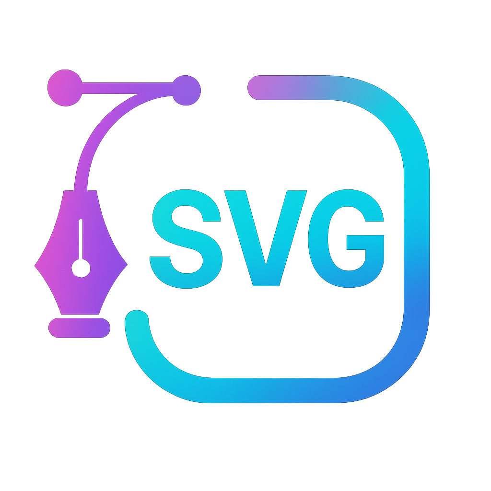

<p align="center">
  
</p>

# SVG Animation Studio

A modern, minimal, dark‑only web app for creating polished SVG animations and exporting them to high‑quality GIF and WebP. The goal of this product is to make SVG animation approachable and fast without sacrificing quality.

This repository contains both the frontend editor (React + Vite + Tailwind + Radix UI + Lucide) and a backend renderer (Node + Express + Puppeteer + FFmpeg).

**Why This Exists**

- Simplify SVG animation: Focus on the creative flow, not the tooling.
- High‑quality output: Smooth edges, clean antialiasing, compact files.
- Production‑ready UX: Figma‑like layout, consistent components, dark UI.

**Key Features**

- Drag‑and‑drop SVG upload: Instant preview, progress, and replace support.
- Gallery + Projects: Home page list of recent SVGs (localStorage) with reopen.
- Editor with tabs: Switch between multiple open projects like Figma.
- Layers sidebar: Collapsible list (Radix Accordion) to navigate SVG elements.
- Selection overlay: Crisp rectangle stroke around the selected element.
- Properties panel: Fill, stroke, stroke width, opacity, scale, rotate, etc.
- Animation panel: Entrance, Emphasis, Exit categories with usable controls:
  - Duration and Delay sliders, Direction/Easing dropdowns (Radix Select)
  - Repeat stepper, color pickers (react‑colorful)
  - Emphasis presets (fade‑in‑out, zoom‑in‑out, fly‑in‑out)
- One‑click export: GIF / WebP from the top‑right toolbar.
- Quality pipeline: Supersampled rendering + Lanczos downscale + tuned encoders.

**How It Works**

- Frontend composition: The editor builds a document model from your SVG and the per‑element animation settings. Interaction state persists to localStorage so you don’t lose work.
- Sanitization: The backend cleans the SVG (sanitize‑html) to keep rendering safe.
- Headless rendering: Puppeteer launches Chromium, loads an HTML page that embeds your sanitized SVG and the animation runtime.
- Frame synthesis: For each frame (based on `fps` and duration), the page executes `__applyFrame(t)` to compute transforms, opacity, color, and masks, then screenshots a transparent PNG.
- Frame dedupe: Consecutive identical frames are collapsed to reduce size.
- Encoding: FFmpeg assembles unique frames into GIF or WebP with tuned settings:
  - GIF: 256‑color palette, Floyd–Steinberg dithering, Lanczos scale
  - WebP: quality 90, alpha support, Lanczos scale

**Project Structure**

- Frontend (React + Vite): `frontend`
- Backend (Express + Puppeteer): `backend`
- Core export services:
  - Renderer: `backend/src/services/rendererPuppeteer.js`
  - Exporters: `backend/src/services/exporter.js`
  - Controller: `backend/src/controllers/exportController.js`

**Quick Start**

- Prerequisites

  - Node.js 18+ (or 20+ recommended)
  - No system FFmpeg required (bundled via `ffmpeg-static`)

- Backend (port 4000)

  - `cd backend`
  - `npm install`
  - `npm run dev`

- Frontend (port 3000, proxies `/api` → 4000)

  - `cd frontend`
  - `npm install`
  - `npm run dev`
  - Open `http://localhost:3000`

- Build
  - Frontend: `cd frontend && npm run build`
  - Backend (server only): `cd backend && npm run start`

**API (Export)**

- `POST /api/export/gif`
- `POST /api/export/webp`
- Body (JSON):
  - `svg`: serialized SVG markup (string)
  - `width`, `height`: canvas size (1–1080)
  - `fps`: frames per second (1–30)
  - `elements`: `[ { id, animations: Animation[] } ]`
- Animation fields include `type`, `start`, `duration`, `loop`, `direction`, `easing`, plus type‑specific fields like `from`, `to`, `freq`, `bounces`, `distance`, `path`, etc.

Example minimal payload

```
{
  "svg": "<svg ...>...</svg>",
  "width": 800,
  "height": 600,
  "fps": 24,
  "elements": [
    { "id": "title", "animations": [
      { "type": "fadeIn", "start": 0, "duration": 1000 },
      { "type": "opacityLoop", "start": 1000, "duration": 1000, "min": 0.5, "max": 1 }
    ]}
  ]
}
```

**Output Quality**

- Supersampling: Headless Chromium renders at 2× device scale to smooth edges.
- Downscale: Lanczos resampling preserves detail when scaling to the target size.
- GIF tuning: 256‑color palette, full stats, Floyd–Steinberg dithering.
- WebP tuning: q=90 with alpha, good balance between quality and size.

**Roadmap**

- Shape tools: Create rectangles, circles, paths directly in the canvas.
- Path editor: Point editing, boolean ops, smoothing, auto‑trace.
- SVG editing: Re‑order layers, group/ungroup, lock/visibility, batch edits.
- Timeline: Keyframes, scrubbable timeline, easing curves, presets.
- Assets: Upload libraries, symbols, reusable components.
- Export to video: MP4/WebM, transparent video.
- Collaboration: Share links, comments, real‑time cursors.

**Contributing**
We welcome issues and pull requests! To contribute:

- Discuss: Open an issue describing the problem or proposal.
- Fork & branch: Keep changes focused and scoped.
- Code style: ESM modules, small, composable components, and consistent Tailwind classes.
- Frontend: React + Vite + Tailwind + Radix UI; use existing patterns for panels and events.
- Backend: Express; renderer via Puppeteer; avoid blocking operations in request handlers.
- Testing: Validate exports locally; please include before/after notes for quality tweaks.

If you’re not sure where to start, look at “Good first issues” or propose a small UX improvement (labels, icons, shortcuts) — design polish is always welcome.

**Acknowledgements**

- Built with React, Tailwind, Radix UI, Lucide icons
- Rendering powered by Puppeteer and FFmpeg

> This project aims to make SVG animation effortless and beautiful. In upcoming releases we’ll add shape/path creation and deeper SVG editing right in the editor. Stay tuned — and help us get there!
